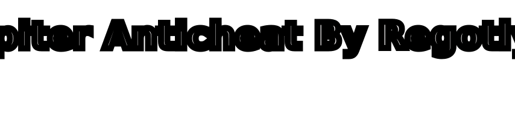

# SpiterAnticheat
中文
欢迎使用Spiter
在这里，您可以找到常见问题解答、设置指南和我们的API文档

你需要一点帮助？
加入QQ群和Discord或者KOOK。
KOOK: https://kook.top/fyLlw2

Discord: https://discord.gg/p4epGCvwkp

QQ Group: 759357642
# 目前不看kook和discord信息，请你使用qq联系我

英文
Welcome to Spiter Docs
Here you can find answers to FAQ, setup guide and our API documentation

Need a little help?
Discord: https://discord.gg/p4epGCvwkp

QQ Group: 759357642

This is where you'll find me.
---

---
> [Alerts]  

---

> [!NOTE]  
> This anti-cheat was produced in May 2023 and is still in the testing and production stage. If you have any questions, please contact me.

---

> [!购买须知]
> 免责声明和责任限制
> 用户条款-中文：
> 本协议是用户与Spiter及其旗下任何软件/插件之间，关于用户使用Spiter及其服务所订立的合约。在使用Spiter的服务前，用户须仔细阅读并遵守《用户条款》（以下简称“条款”）。这些条款是双方商定的法律文件，具有法律效力。用户通过付款、向Spiter开发者确认，或通过任何形式使用Spiter服务，包括> 明示或默示的接受，都视为用户已阅读并同意本协议。
>
> 请在阅读、理解并接受协议的所有内容后，才使用Spiter服务。特别注意其中免责或限制责任的条款、限制用户权利的条款、争议解决方式和司法管辖的条款，以及针对特定服务的单独协议或规则。
>
> 如果您是未成年人或具有限制民事行为能力的人，请在法定监护人的陪同下阅读和评估是否同意本协议。
> 未成年人购买必须在监护人的陪同下一同付款
>
> 如果您不在中国大陆地区，您还需要遵守您所在的国家或地区的法律。
>
> 权益范围：
> Spiter是指Spiter及其可能存在的运营相关单位。在本协议中，使用Spiter及旗下软件/插件服务的人被称为“用户”，或在此文中直接称为“您”。
> 
> Spiter及旗下任何软件/插件提供的服务可能包括但不限于即时通讯、网络媒体、互联网增值服务、互动娱乐、金融支付、广告等。具体服务以Spiter及其旗下软件/插件实际提供的内容为准。
>
>通过继续使用Spiter的服务，您表示您已充分理解并同意接受本协议的所有条款。如果您不同意本协议的任何内容，请您不要注册或使用Spiter提供的任何服务。
>
>密钥安全：
>在使用Spiter及旗下任何软件/插件，（以下统称为"Spiter"）时一般都有“密钥”，作为您使用的凭证，特别提醒您应妥善保管您的密钥。当您使用完毕后，若不是您个人的设备，请及时清理和删除，不推荐您在不是您个人的设备上运行任何软件。因您保管不善可能导致遭受密钥失窃，责任由您自行承担。
>
>为增强用户体验和/或技术便利，本服务的密钥可能包括数字、字母或者其组合，以及手机号码、电子信箱等多种形式。在您购买注册某一形式的密钥时，我们可能附赠该密钥的另一表现形式。具体的密钥形式、密钥之间的关联关系等，以Spiter的具体服务、实际提供的为准。
>
>(在使用Spiter及其旗下的软件或插件时，密钥是您身份验证和使用服务的凭证。因此，保护好您的密钥至关重要。下面是一些您需要注意的事项：
>
>妥善保管密钥：请确保将密钥存放在一个安全的地方，防止未经授权的访问或使用。失去密钥控制可能会给您造成不可预见的风险和损失。
>
>设备安全：若您在使用非个人设备时需要输入密钥，建议在使用完毕后清理和删除相关信息，避免在公共或非个人设备上运行敏感软件。
>
>防范密钥失窃：任何因个人疏忽或保管不当导致的密钥失窃或泄露，由用户本人承担相应责任。
>
>密钥形式多样：出于对用户体验和技术便利的考虑，Spiter提供的密钥可能会有多种表现形式，包括但不限于数字、字母组合、手机号码、电子邮箱等。
>
>密钥关联：当您购买某个形式的密钥时，Spiter可能会提供密钥的其他形式作为补充。这些密钥之间如何关联以及它们的具体形态，将取决于Spiter提供的具体服务和实际提供的内容。
>
请谨遵上述指引，并对密钥的管理和保护承担个人责任。Spiter及其旗下服务对于用户密钥的保护和使用不承担任何责任，用户应确保自身在购买、存储和使用密钥方面的安全性。任何密钥相关的安全问题都需要您高度重视)
>
>您理解并同意：
>1本服务是按照现有技术和条件所能达到的现状提供的。Spiter会尽最大努力保障服务的连贯性和安全性，但Spiter不能随时预见和防范法律、技术以及其他风险，Spiter对此类风险在法律允许的范围内免责，包括但不限于不可抗力、病毒、木马、黑客攻击、系统不稳定、第三方服务瑕疵、政府行为等原因可能导>致的服务中断、数据丢失以及其他的损失和风险。
>
>因经营策略安排或调整等原因,不同地区的用户可使用的具体Spiter服务的内容可能会存在差异，具体以Spiter实际提供的为准。
>
>0.以下条款必须遵守以继续使用本软件，一旦购买后若违反本条款，后果由用户自行承担。Spiter 制作组对由用户自行造成的损失不承担任何责任。
>
>1.本产品不提供任何形式的明示或暗示保证，包括但不限于适销性、特定用途的适用性及非侵权的保证。我们不对因使用本软件而产生的任何形式的损害或索赔承担责任，这些包括但不限于利润损失、数据丢失或业务中断的索赔。
>
>2.本产品的购买仅限于个人使用，不得将产品授权或令牌转让给他人。违反此规定将视为自动放弃使用权。禁止将Spiter用于任何形式的测试或提供测试服务。
>
>3.令牌只能绑定至购买时指定的服务器上使用，如有违反，则我们有权取消您的使用资格。
>
>4.您不得对外公开您使用Spiter反作弊的任何信息。
>
>5.Spiter的购买条款明确禁止转卖，令牌只能授予购买者。若将令牌转赠、转售等，我们将终止服务。新版本或特定版本仅支持一台设备，需要额外绑定请与我们联系。解绑流程复杂，我们无法频繁地为您解绑。
>
>6.在购买前，请仔细阅读Kook平台或相关的购买指南。否则，您的订单号和权限可能会被我们删除。此外，Spiter插件以“现状”方式提供，无任何形式的保证。
>
>7.Spiter开发的插件及相关文件和文档不提供任何形式的保证，包括但不限于适销性或特定用途的适用性保证。
>
>8.Spiter软件及其附件不保证软件运行不中断或无错误，也不保证所有错误将得到纠正。作为用户，您全权负责确定本插件是否适合您的需求，并自行承担使用相关的所有风险。
>
>9.只有在您接受本条款且不违背任何条款的前提下，开发者才不会干预您的使用或承担任何责任。
>
>10.若需要技术支持，需提供您的DIMID、HWID、ID和操作系统的截图，否则，我们不予处理。
>
>11.使用Spiter时，严禁向其他玩家透露任何反作弊相关信息，如被发现，将视为违反用户守则处理。
>
>12.严禁向任何管理人员索要任何反作弊信息。
>
>13.要使用Spiter插件，用户需在我们的KOOK或QQ上购买有效的许可证。用户应当保持良好的软件使用习惯，并不得以任何方式重新分发、反编译、反汇编或修改Spiter及其相关服务。通过使用Spiter服务，用户确认所提供的信息准确无误，且不得转售软件的任何部分。
>
>我们承认本软件可能无法检测到所有形式的作弊行为。尽管如此，我们保留对此反作弊软件的维护和更新的权益，以不断提高其性能和效率。用户在使用本软件时是理解这一点，毕竟不是所有的锁都能防止开锁的人进，并接受其检测能力的限制。同时，Spiter团队会持续努力改进软件，以更好地服务于用户。
>
>对于由于不可抗力造成的问题，例如自然灾害、战争、政府行为、公共危机、黑客攻击、网络中断或其他类似事件，我们不承担任何责任。这些外部事件不可预测且无法控制，因此如果它们对我们提供服务的能力产生影响，我们不对由此造成的服务中断或用户遭受的任何损失负责。
>
>16.为了优化我们的服务、防止盗版并分析软件性能，我们可能会收集一些数据，包括但不限于反作弊日志、许可证活动记录以及使用软件的服务器IP地址和硬件识别码（Hwid）。用户在使用我们的软件时，不得透露任何相关使用信息，包括但不限于警报显示或与我们软件/服务的其他任何组件相关的数据。
>
>17.任何尝试绕过我们反作弊机制的行为，如制作或使用脚本、工具来访问、抓取或下载Spiter的任何文件或数据都是被严禁的。
>
>18.虽然Spiter提供客户技术支持，但该支持不是保证性的，在某些情况下，我们可能会因怀疑客户违反服务条款或对我们软件或服务器造成损害而拒绝或限制提供支持。
>
>19.我们保留限制某些IP地址访问我们服务的权利。用户应该理解，本软件并不能保证检测到所有的作弊行为，因此不对任何由此可能导致的损害承担责任。
>
>20.Spiter软件保留随时更新或修改软件的权利，以提升检测效能、增强性能、加强安全性或添加新功能，恕不提前通知。
>
>21.用户同意接受这些条款并认识到这些条款的存在是为了提供更好的服务和保护我们的合法权益，同时确保用户合理合法地使用我们的软件和服务。在法律允许的范围内，我们保留追究违反这些条款的用户的法律责任的权利。
>
>如果您对Spiter旗下任何软件进行攻击、破解或对服务器展开攻击行为，Spiter将依据适用的法律追究您的法律责任。为确保所有用户的权益和服务的正常运行，我们将严肃处理任何形式的非法侵害行为。如果您未购买本产品，但同样对我们的服务进行了攻击，Spiter保留权利依据适用法律对您追究法律责任。>>此类行为严重威胁了服务的安全与稳定，并侵犯了合法用户的利益，因此我们将采取必要的法律措施以维护我们的权益和服务的正常运作。
>
>禁止行为
>用户严禁转售、共享或重新分发软件的任何部分，包括配置文件、检查结果、反作弊日志或许可证。违反本禁止规定将面临法律追究。
>
>数据收集和隐私
>
>2. 为了改善服务、预防盗版和进行软件性能分析，我们可能会收集包含但不限于用户反作弊日志、许可证活动日志、使用软件的服务器IP地址和硬件识别码（Hwid）在内的数据。用户不得透露关于该软件使用情况的任何信息。
>
>技术支持和退款政策
>3. Spiter 可提供技术支持，但不保证一定提供。需上传DIMID, HWID, ID和操作系统截图方可获得支持。
>
>购买许可证后的24小时内，用户如果需要申请退款，必须提供充分的退款理由。
>
>24小时后，无论出于何种原因，我们将不再提供任何形式的退款。
>
>因此用户在购买前应仔细考虑以确保产品满足其需求。
>
>软件使用条件：
>
>4. 用户在购买Spiter许可证前，必须清楚了解并同意服务条款。如用户违反服务条款，Spiter有权暂停或终止用户许可证。
>
>禁止将Spiter软件用于诽谤、骚扰或歧视他人。
>
>用户对违反服务条款行为全权负责，无论是意外发生或由第三方引起的。
>
>用户必须遵循所有服务条款，即使条款未经事先通知即可能发生变更。
>
>禁止修改Spiter Loader信息或任意修改Spiter其他文件。
>
>用户获取Spiter许可证后，不得将其部署在测试服务器或向玩家提供测试用途的反作弊警报。
>
>企业版用户可根据需要申请添加功能。
>
>责任限制和赔偿
>
>12. 对于因用户使用软件、违反本协议或违反任何适用法律而导致的所有索赔、损害、责任、成本和费用(包括合理的律师费用) ，用户同意赔偿并保障 Spiter作者“狼狗”(指QQ:1184508510)及其关联公司、管理人员、代理人和雇员免遭损失。
>
>协议解释
>
>13. 本协议中的标题和段落仅为方便阅读，并不影响条款的实施。本协议构成双方之间就本事项达成的完整协议，取代任何先前的书面或口头协议，用户购买Spiter反作弊软件即表示其已经明确知晓并同意这些条款。如用户对条款有疑问，请在付款前向我们咨询。
>
>用户在以下情况下将面临许可证的暂停或中止：
>当我们有合理理由相信您（用户）参与非法、欺诈或不诚信行为时；
>
>您开发、购买、分发、使用或企图绕过Spiter提供的防作弊技术，或在网络游戏中为自己获取不公平优势时；
>
>您参与软件盗版或与软件盗版行为有关时；
>
>您发布、传播或制作Spiter软件的非法副本时；
>
>您提供的有关自己或自己的服务器的信息不真实、不准确或不完整时；
>
>您违反本协议任何条款或相关政策时；
>
>我们有理由相信您的服务器用于可能对Spiter或其他服务器构成安全威胁的活动时。
>
>我们不承担由于修改、暂停或终止服务引起的任何损失或损害的责任。
>我们保留随时更改服务价格的权利，不另行通知。服务条款的任何更改将立即生效。
>
>如果因用户不当使用导致问题，我们不承担任何后果。
>
>Spiter许可证一经激活使用，将不予退款。在特殊情况下，用户需要在购买后24小时内提供充分的退款理由。产品在激活前不得被记录（包括但不限于Spiter后台服务器日志、令牌使用日志等）。
>
>严禁将Spiter内部群组的任何信息泄露给他人，包括但不限于聊天记录、文件等。
>
>如果您对以上条款有疑问或不接受，建议您不要购买本反作弊软件。
>
>经退款的用户将无法再次购买本反作弊软件以及旗下的任何内容。
>
>未经Spiter管理团队明确授权，用户不得透露任何内部信息，包括但不限于内部QQ群组的聊天记录、关于Spiter的任何内部文件、配置以及其他通讯记录。如违反此规定而损害我们的合法权益，我们保留追究相关法律责任的权利。用户在使用Spiter软件和服务时，应严格遵守此保密义务。
>
>22.其中因许可证的暂停或中止无法退款。
>
免责说明：

1 您理解并同意，在使用本服务过程中，可能会遇到不可抗力等风险因素，这些因素可能会对本服务产生影响。不可抗力是指那些无法预见、无法克服且无法避免，而且会对一方或双方产生重大影响的客观事件，包括但不限于自然灾害（如洪水、地震、瘟疫流行和风暴）以及社会事件（如战争、动乱、政府行动等）。当出现上述情况时，Spiter将尽力在第一时间配合相关单位采取措施进行处理，但因此给您造成的损失，在法律允许的范围内，Spiter免于承担责任。

2 在法律允许的范围内，Spiter对以下情形导致的服务中断或中止，不承担责任：

（1）由计算机病毒、木马或其他恶意程序、黑客攻击造成的破坏。

（2）用户或Spiter的电脑软件、系统、硬件和通信线路故障。

（3）用户操作不当或通过未经Spiter授权的方式使用服务。

（4）软件程序版本过时、设备老化以及/或存在兼容性问题。

（5）其他Spiter无法控制或合理预见的情况。

3 您理解并同意，在使用本服务过程中，可能存在来自网络信息或其他用户行为的风险，Spiter不对任何信息的真实性、适用性或合法性承担责任，也不负责因侵权行为对您造成的损害。可能遇到的风险，包括但不限于：

（1）收到他人匿名或伪造的含威胁、诽谤、令人不快或非法内容的信息。

（2）遭受误导、欺骗或可能导致的任何精神、身体上的伤害和经济损失。

（3）由网络信息或用户行为引起的其他风险。

4 Spiter根据本协议得到处理违法违规内容的权利，此权利不构成Spiter的义务或承诺，Spiter不能保证能及时发现违法行为或进行处理。

5 在任何情况下，您都不应轻信涉及借款、索要密码或其他可能涉及您财产安全的信息。进行财产上的操作时，请先核实对方身份，并留意Spiter提供的有关防范诈骗犯罪的提示。

【未成年人使用条款】
   1.若用户未满18周岁，则为未成年人，应在监护人监护、指导下阅读本协议和使用本服务。

   2.未成年人用户涉世未深，容易被网络虚像迷惑，且好奇心强，遇事缺乏随机应变的处理能力，很容易被别有用心的人利用而又缺乏自我保护能力。因此，未成年人用户在使用本服务时应注意以下事项，提高安全意识，加强自我保护：

    （1）认清网络世界与现实世界的区别，避免沉迷于网络，影响日常的学习生活。

    （2）填写个人资料时，加强个人保护意识，以免不良分子对个人生活造成骚扰。

    （3）在监护人或老师的指导下，学习正确使用网络。

    （4）避免陌生网友随意会面或参与联谊活动，以免不法分子有机可乘，危及自身安全。

    3.监护人、学校均应对未成年人使用本服务多做引导。特别是家长应关心子女的成长，注意与子女的沟通，指导子女上网应该注意的安全问题，防患于未然。

【管辖与法律适用】 
1本协议的成立、生效、履行、解释及纠纷解决等相关事宜，均适用中华人民共和国大陆地区法律（不包括冲突法）。

 2本协议签订地为中华人民共和国北京市西城区。

 3若您和Spiter开发组之间发生任何纠纷或争议，首先应友好协商解决；协商不成的，您同意将纠纷或争议提交本协议签订地（即中华人民共和国北京市西城区）有管辖权的人民法院管辖。 

4本协议所有条款的标题仅为阅读方便，本身并无实际涵义，不能作为本协议涵义解释的依据。

 5本协议条款无论因何种原因部分无效或不可执行，其余条款仍有效，对双方具有约束力。

 6若本协议有中文、英文等多个语言版本，相应内容不一致的，均以中文版的内容为准。

本用户条款可能会根据法律要求进行更新。用户有责任定期查阅以确保了解最新版本的用户条款。继续使用Spiter软件即表示用户接受并同意新修订的条款。
通过理解和遵守这些条款，用户才能享有Spiter提供的服务。我们保留随时更新或修改本条款的权利。
[隐私政策]：
为了改善服务、预防盗版和进行软件性能分析，我们可能会收集包含但不限于用户反作弊日志、许可证活动日志、使用软件的服务器IP地址和硬件识别码（Hwid）在内的数据。

您的 HWID（硬件 ID）、DIMID（子服服务器信息id）, ID（MD5值）、QQ账户号码、操作系统（用户名或账户和操作系统类别）、服务器基本信息和互联网协议地址（IP）经您同意收集，用于验证从Spiter及其旗下软件购买的软件的使用。

可能会收集您的个人信息

流量数据：
流量数据主要以用户访问产品/页面时，从启动到使用产品等一系列的过程都会产生许多流量数据。流量数据定义为用户访问产品时/页面时产生的数据，需要Spiter通过数据采集来获取数据，其中您的 IP 地址是由互联网服务提供商分配给您电脑的数字地址。我们会自动收集您的 IP 地址向我们服务器发送的数据作为流量数据，以便在需要时向您发送信息，这些信息不会附加到个人身份信息中，系统信息，例如您的操作系统/平台以及您使用的网络浏览器类型。这些信息与个人身份信息无关，监控程序/插件的存在。如果您在使用Spiter及其旗下软件时正在使用网络监控程序或相关程序，我们可能会收集该信息以通知您其存在。这是为了防止对Spiter进行分析，这会违反用户条款。

Spiter会严格遵守法律法规，遵循以下隐私保护原则，为您提供更加安全、可靠的服务：
安全可靠：我们竭尽全力通过合理有效的信息安全技术及管理流程，防止您的信息泄露、损毁、丢失。

保护通信秘密：我们严格遵照法律法规，保护您的通信秘密，为您提供安全的通信服务。

合理必要：为了向您和其他用户提供更好的服务，我们仅收集必要的信息。

公开透明：我们努力使用简明易懂的表述，向您介绍隐私政策，以便您清晰地了解我们的信息处理方式。

将隐私保护融入产品设计：我们在产品和服务研发、运营的各个环节，融入隐私保护的理念。

我们收集的信息会根据法律法规的要求，遵循合法、正当、必要和诚信的原则，仅收集实现产品功能所必要的个人信息。

您在使用我们服务时主动提供的信息
您在注册或使用我们的产品或服务时，主动填写或上传的QQ号、手机号码、文件、令牌等。

您通过我们的客服或参加我们举办的活动时所提交的信息。

我们一些特定的服务可能需要您提供特定的个人信息来实现相关功能。若您选择不提供该类信息，将不会影响您使用产品或服务中的其他功能。

我们在您使用服务时获取的信息
·日志信息例如，当您使用我们的服务时，为了维护产品与服务的安全稳定运行，我们可能会收集设备信息、软件信息、服务日志信息等相关信息。

通讯信息：在使用我们产品的时候需要随时接收和发送的Spiter服务必须的数据包，例如玩家的移动、转头、攻击等数据包

其他相关信息为了帮助您更好地使用我们的产品或服务，经您的明确授权我们可能会收集相关信息，例如，你使用我们的产品中需要上传文件的功能，是您主动提交的。

其他情况获取的信息 
在法律允许的情况下，经过您的同意，我们可能会获得您在使用第三方合作伙伴服务时所产生或分享的信息。例如，您使用幻影盾X或登录第三方合作伙伴服务时，我们会获得您登录第三方合作伙伴服务的名称等信息。

我们如何使用信息： 
我们严格遵守法律法规的规定及与用户的约定，将收集的信息用于以下用途。

若我们超出以下用途使用您的信息，我们将再次向您进行说明，并征得您的同意。 

向您提供服务 满足您的个性化需求 例如，语言设定、个性化的帮助服务。 

安全保障：
例如，我们会将您的信息用于身份验证、安全防范、反诈骗监测、存档备份、客户的安全服务等用途。例如，您下载或安装的安全软件会对恶意程序或病毒进行检测，或为您识别诈骗信息。 向您推荐您可能感兴趣的广告、资讯等 评估、改善我们的广告投放和其他促销及推广活动的效果 

管理软件： 
例如，进行软件认证、软件升级等。 邀请您参与有关我们服务的调查 为了让您有更好的体验、改善我们的服务或经您同意的其他用途，在符合相关法律法规的前提下，我们可能将通过某些服务所收集的信息用于我们的其他服务。

例如，将您在使用我们某项服务时的信息，用于个性化的服务体验、用户研究分析与统计等服务。 

为了确保服务的安全，帮助我们更好地了解我们应用程序的运行情况，我们可能记录相关信息，例如，您使用应用程序的频率、故障信息、总体使用情况、性能数据以及应用程序的来源。我们不会将我们存储在分析软件中的信息与您在应用程序中提供的个人身份信息相结合。

账户、令牌信息
您的信息保存在一个安全的网络服务器上，我们相信这是一个受到良好保护的环境。仅将个人信息提供给账单公司，用于完成交易，而不用于其他目的。在任何情况下，我们都不会出于任何目的与任何第三方公司共享其他信息。Spiter会尽一切努力保护您的隐私，但在法律要求的情况下，如果我们有充分的理由相信有必要遵守司法程序、法院命令或法律程序，我们可能会披露您的个人信息。

有任何问题或疑虑？

请QQ群中联系狼狗 
>
> 售价 69.99 欧元 - 部分假期可能有优惠活动
> 感谢你的支持

---
